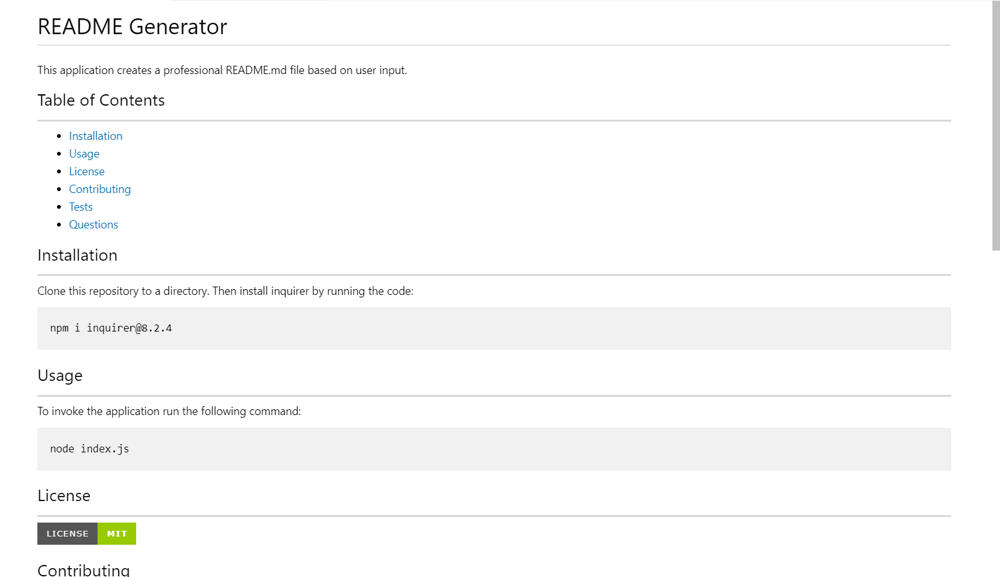

# README Generator
This application creates a professional README.md file based on user input.

## Table of Contents
---
- [Installation](#installation)
- [Usage](#usage)
- [License](#license)
- [Contributing](#contributing)
- [Tests](#tests)
- [Questions](#questions)

## Installation
---
Clone this repository to a directory. Then install inquirer by running the code:

    npm i inquirer@8.2.4

## Usage
---
To invoke the application run the following command:

    node index.js

https://drive.google.com/file/d/1Vlg9W5aIx1NtcsbSBxe-ykFkXSFAQmQ3/view

## License
---

## Contributing
---
Please refer to the [Contributor Covenant](https://www.contributor-covenant.org/) before contributing to this project.

## Tests
---
To test this application fallow the instructions listed above and generate your own README markdown file.

## Questions
---
https://github.com/kyleschop/

Please email klparuu@yahoo.com with additional questions. 